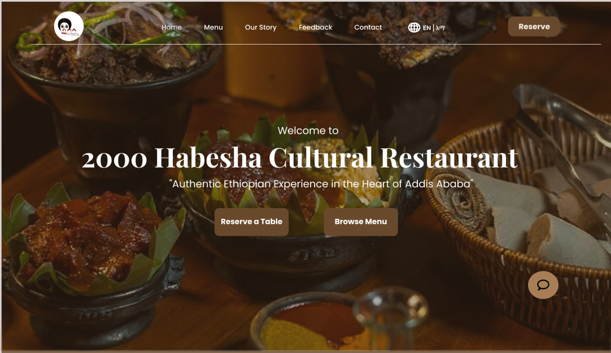
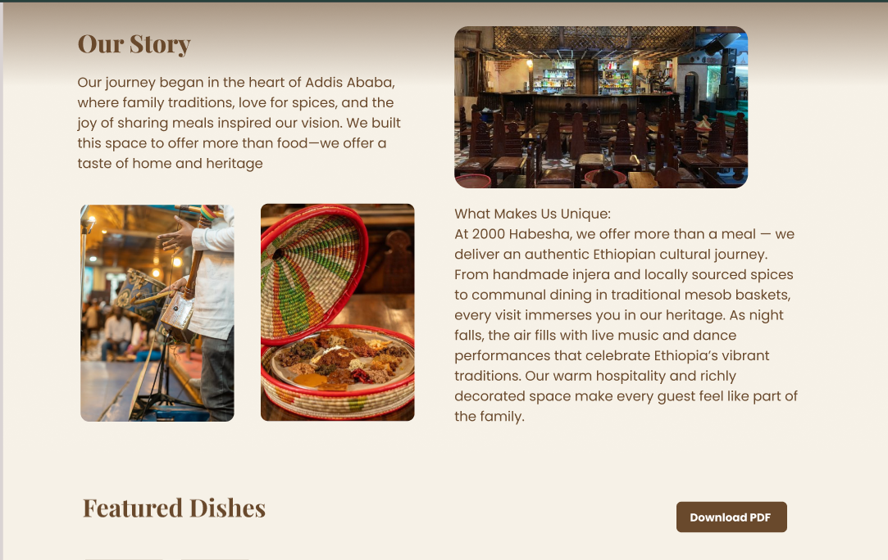
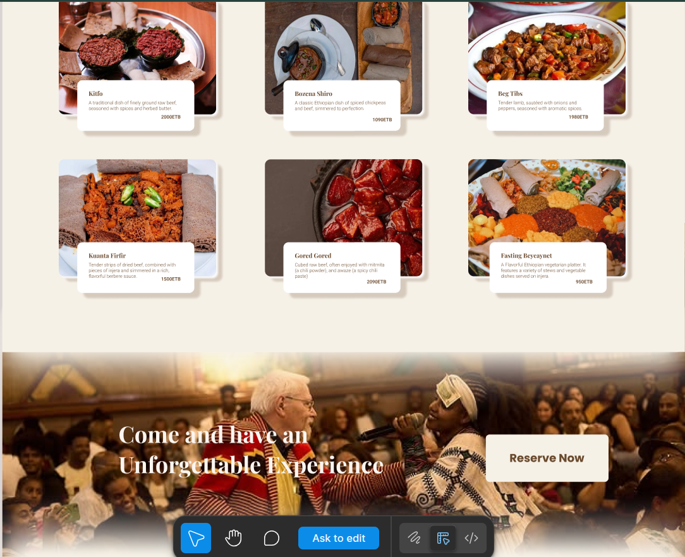

Here’s an enhanced `README.md` draft for **2000 Habesha Restaurant**, tailored to reflect its cultural essence and your project setup:

---

# 2000 Habesha Restaurant

**A vibrant React + Vite web app celebrating the culture and cuisine of Addis Ababa’s iconic 2000 Habesha Cultural Restaurant.**

## ⬇️ Description

2000 Habesha offers “a full Ethiopian cultural journey through traditional cuisine, live performances, and unforgettable hospitality” in Addis Ababa’s Bole area ([2000 Habesha][1]). Founded in 2000 to commemorate Ethiopia’s millennium, the restaurant immerses guests in authentic culture through dishes like Doro Wat, Tibs, Kitfo, Shiro, vegan Beyaynetu, and nightly dance and music shows ([2000 Habesha][1]).

This web application aims to:

- Showcase the restaurant’s story, menu, and ambience
- Feature photo galleries and embedded videos
- Provide reservation/contact info and cultural highlights




## 🚀 Installation

To run this project locally:

```bash
git clone https://github.com/zeamanuel145/2000-habesha_2.0.git
cd 2000-habesha-restaurant
npm install
npm run dev
```

Then open `http://localhost:5173` (or whatever port Vite uses).

## 🛠️ Technologies Used

- ✨ [React](https://reactjs.org/) – UI library
- 🔥 [Vite](https://vitejs.dev/) – Fast build & dev server
- 🛠️ [@vitejs/plugin-react](https://github.com/vitejs/vite-plugin-react) – React Fast Refresh
- 🧹 [ESLint](https://eslint.org/) – Code linting
- (Optional: TypeScript support via [`plugin-react-swc`](https://github.com/vitejs/vite-plugin-react-swc) and `typescript-eslint`)
- 🎨 Add-on libs (e.g., Tailwind, Chakra UI, React Router) – customize as needed

## 📸 Screenshots






## 👥 Authors

- Bontu Duguma
- Zeamanuel Fetene
- Natnael Abnew
- Robel Alemayew
- Eric
